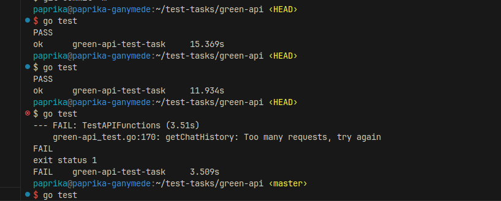

# GREEN API Test task

## Running

1. Fill config.json
```json
{
    "apiUrl": "",
    "mediaUrl": "",
    "idInstance": "",
    "apiTokenInstance": ""
}
```

2. run go test
```bash
$ go test
```

3. results



## Tests overview

### sendMessages
```go
	{
		Input: SendMessageInput{
			ChatId: "invalid id",
		},
		Expected: ExpectedResult{
			Status:   400,
			Contains: []string{"Validation failed", "'chatId'"},
		},
	},
	{
		Input: SendMessageInput{
			ChatId:  "77083674713@c.us",
			Message: "",
		},
		Expected: ExpectedResult{
			Status:   400,
			Contains: []string{"Validation failed", "'message'"},
		},
	},
	{
		Input: SendMessageInput{
			ChatId:  "77083674713@c.us",
			Message: "workin??",
		},
		Expected: ExpectedResult{
			Status: 200,
		},
	},
```

1. Just pass invalid 'chatId' and expect BadRequest
2. pass valid 'chatId' but invalid message and expect BadRequest
3. pass fully valid data and expect OK http status

### getChatHistory
```go
	{
		Input: GetChatHistoryInput{
			ChatId: "invalid id",
		},
		Expected: ExpectedResult{
			Status:   400,
			Contains: []string{"Validation failed", "'chatId'"},
		},
	},
	{
		Input: GetChatHistoryInput{
			ChatId: "77083674713@c.us",
			Count:  1,
		},
		Expected: ExpectedResult{
			Status: 200,
		},
	},
```

1. Just pass invalid 'chatId' and expect BadRequest
2. pass fully valid data and expect OK http status

P.S also tests throw errors on TooManyRequests and InternalServerError and ask you to try again